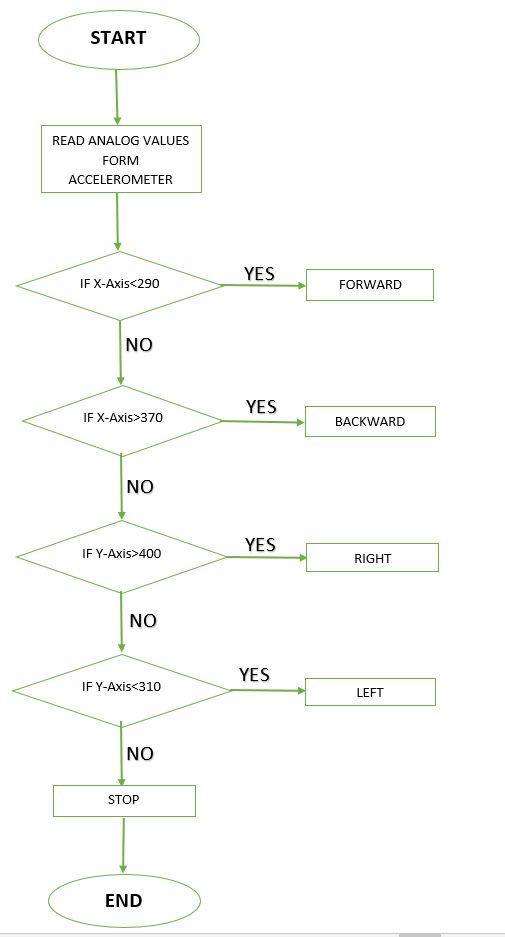

# Gesture-Controlled-Wheelchair-Prototype
Robotics is the new booming field, which will be of great use to society in the coming years. Though robots can be a replacement to humans, they still need to be controlled by humans itself. Beyond controlling the robotic system through physical devices, recent methods of gesture control have become very popular. The main purpose of using gestures is that, it provides a more natural way of controlling and provides a rich and intuitive form of interaction with the robotic system. Human hand gestures are natural and with the help of wireless communication, it is easier to interact with the robot in a friendly way.
My objective was to build a wireless gesture controlled robot using Arduino, accelerometer, RF transmitter and receiver module. The Arduino Uno microcontroller reads the analog output values i.e., x- axis and y-axis values of the accelerometer and converts that analog values to respective digital values. The digital values are processed by the Arduino Uno microcontroller and according to the tilt of the accelerometer sensor mounted on hand, it sends the commands to the RF transmitter which is then transmitted and is received and processed at the receiver end,0 which drives the motor in a particular direction. The robot moves forward, backward, right and left direction when we tilt our palm forwards, backwards, right and left respectively. The robot stops when it is parallel to the ground.

SYSTEM DESIGN
The whole project is divided into two sections -- transmitter section and receiver section. 
Hardware used in transmitter section:
1.	Arduino Uno 
    It is a microcontroller board based on ATmega328 which has 14 digital I/O and 6 analog pins. It has everything that is needed to         support the microcontroller. Arduino Uno can sense the environment by receiving  input  from a  variety of sensors and  can affect       its surroundings by controlling lights, motors, and other actuators.
2.	ADXL335 3-Axis Accelerometer 
    The ADXL335 is a small, thin, low power, 3-axis accelerometer  with  signal conditioned voltage outputs. It has 5 pins. 3 pins is       for X,Y,Z axis. First pin for power supply (VCC), fifth pin for ground (GND). It operates on 3.3V-5V from the Arduino Uno board. It     can measure the static acceleration of gravity for tilt- sensing applications as well as dynamic acceleration resulting from motion,     shock or vibration and gives corresponding analog values through X,Y,Z axis pins. The low cost and small size of 3-axis                 accelerometer, are the two factors that makes it effective to detect hand gestures.
3.	HT12E - Encoder IC
    HT12E is an encoder integrated circuit of 212 series of encoders. It is mainly used in interfacing RF and infrared circuits. HT12E       converts the parallel inputs into serial output. It encodes the 12-bit parallel data into serial for transmission through an RF
    transmitter. These 12 bits are divided into 8 address bits and 4 data bits. 
4.	RF Transmitter Module
    RF stands for radio frequency. It is available in different operating frequencies and with different operating range. I have used       433 MHz RF Tx/Rx module. It can transmit the signal up to 500 ft of range at rate of 1 Kbps to 10 Kbps. Transmitter module consists     of 4 pins (GRD, VCC, DATA, ANTENNNA). DATA pin is connected to the encoder and a single strand 17 cm antenna is connected to the         antenna pin of TX module. Transmitter receives serial data and transmits RF signal wirelessly to the receiver through antenna.
5.	LM7805 Voltage Regulator
    It converts 9V supply form battery into 5V, which is required by all the above components.

Hardware used in receiver section:
1.	HT12D- Decoder IC
    HT12D is a decoder integrated circuit that belongs to 212 series of decoders.  It is mainly provided to interface RF and infrared       circuits.  They are paired with 212 series of encoders. The chosen pair of encoder/decoder should have same number of addresses and     data format. HT12D converts the serial input into parallel outputs. It decodes the serial addresses and data received by RF             receiver, into parallel data and sends them to output data pins.
2.	RF Receiver Module
    Receiver module consists of 8 pins. 3 ground pins, 2 VCC pins, 2 DATA pins and 1 antenna pin. DATA pins are connected to decoder. A     17cm single strand wire antenna is used for receiving RF signal from transmitter.
3.	L293D Motor Driver
    The L293D is a 16 pin IC, with eight pins, on each side, dedicated to the controlling of a motor. There are 2 INPUT pins, 2 OUTPUT       pins and 1 ENABLE pin for each motor. The L293D IC receives signals from the decoder IC and transmits the relative signal to the         motors. It has two voltage pins, one of which is used to draw current for the working of the L293D and the other is used to apply       voltage to the motors. The L293D switches its output signal according to the input received from the decoder IC.
4.	200 rpm DC Motors
5.	LM7805 Voltage Regulator
    It converts 12V supply form battery into 5V, which is required by all the above components except motors.
Software Used:
  The program is written in Arduino Integrated Development Environment (IDE). I used version 1.8.5. It connects to the Arduino hardware   to upload programs. But before uploading the program there is a need to select appropriate Microcontroller so, “Arduino Uno” from the   Tool menu has been chosen.  And for proper communication with computer and Arduino Uno boards there is a need to select COM port from   the Tool menu.

## Flow Chart

 

  
  

